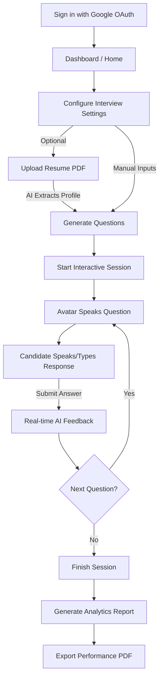

# InterviewPilot🤖✨

InterviewPilot is a state-of-the-art, AI-powered mock interview preparation platform designed to help candidates build confidence, refine their communication skills, and ace real-world job interviews. By combining AI-driven resume parsing, customized question generation, interactive voice-synchronized avatars, and instant performance feedback, InterviewPilot acts as a personal, 24/7 mock interviewer.

---
## 🌐 Live Demo

🔗 **Live Website:** [InterviewPilot](https://interview-pilot-black.vercel.app)

---

## 📸 Screenshots

<p align="center">
  
  

</p>

<p align="center">
  
  
</p>

<p align="center">
  
  
</p>

---

## 🌟 Key Features

- **📄 AI Resume Analyzer**: Upload your resume in PDF format. The backend extracts text using `pdfjs-dist` and leverages OpenAI's `gpt-4o-mini` (via OpenRouter) to identify your roles, experience level, core projects, and technical skills automatically.
- **⚙️ Customizable Interview Sessions**: Set up tailored mock interviews. Choose your target role, experience, and mode (**Technical** or **HR**), or use the auto-extracted resume details.
- **🎭 Real-Time Voice & Video Avatars**:
  - Live animated female/male AI avatars (`female-ai.mp4` / `male-ai.mp4`) that are synchronized with the Speech Synthesis.
  - Interactive speech options using the browser's **Web Speech API** (`webkitSpeechRecognition` for speech-to-text response tracking and `speechSynthesis` for natural voice pacing).
  - Time-limited questions categorized by a structured difficulty curve:
    - *Question 1 & 2* → Easy (60-second limit)
    - *Question 3 & 4* → Medium (90-second limit)
    - *Question 5* → Hard (120-second limit)
- **📊 Real-time AI Evaluation**: Submissions are graded immediately on a scale of `0-10` across three vital categories:
  - **Confidence**: Focuses on clarity, speed, and presentation.
  - **Communication**: Evaluates simplicity and structure.
  - **Correctness**: Assesses relevance and accuracy.
  - *Provides instant, constructive, 10–15 word professional feedback.*
- **📈 Rich Analytics Dashboard**: Get a breakdown of overall scores, skill evaluations, and performance trends using interactive charts (via `Recharts` and `react-circular-progressbar`).
- **🗂️ History Tracking**: Track past interviews, analyze performance progression over time, and revisit previous reports.
- **📄 Professional PDF Reports**: Download structured performance reports containing scores, advice, and detailed question-by-question breakdowns using `jsPDF` and `jspdf-autotable`.
- **💳 Built-In Subscription & Payments**: Start with **100 free credits** (50 credits consumed per interview). Recharge using the integrated **Razorpay Payment Gateway** (Starter Pack: ₹100 for 150 credits; Pro Pack: ₹500 for 650 credits).

---

## 🛠️ Tech Stack

### Frontend
- **Framework**: React 19 + Vite
- **State Management**: Redux Toolkit (auth tracking & profile info)
- **Routing**: React Router DOM (v7)
- **Styling**: Tailwind CSS (v4)
- **Animations**: Framer Motion (`motion`)
- **Visual Analytics**: Recharts, React Circular Progressbar
- **PDF Generation**: jsPDF, jsPDF AutoTable
- **Browser APIs**: Web Speech API (`SpeechSynthesis`, `webkitSpeechRecognition`)

### Backend
- **Runtime**: Node.js
- **Framework**: Express.js (v5)
- **Database**: MongoDB (via Mongoose ODM)
- **Authentication**: Firebase Google Authentication (Client SDK) + JWT Cookies (HTTP-only)
- **File Upload**: Multer
- **PDF Parsing**: PDFJS-Dist
- **Payment Processing**: Razorpay Node SDK
- **AI Engine**: OpenRouter API (`openai/gpt-4o-mini`)

---

## 📁 Project Structure

```text
InterviewPilot/
├── client/                     # Frontend Application (Vite + React)
│   ├── public/                 # Static Assets
│   ├── src/
│   │   ├── assets/             # Images, icons, and AI avatar videos
│   │   │   └── videos/         # male-ai.mp4 & female-ai.mp4
│   │   ├── components/         # Reusable layouts and step managers
│   │   │   ├── AuthModel.jsx
│   │   │   ├── Footer.jsx
│   │   │   ├── Navbar.jsx
│   │   │   ├── Step1SetUp.jsx  # Interview configuration & resume parsing
│   │   │   ├── Step2Interview.jsx # Avatar rendering & Web Speech recognition
│   │   │   ├── Step3Report.jsx # Analytics and PDF export options
│   │   │   └── Timer.jsx       # Custom circular time tracker
│   │   ├── pages/              # Main routing views
│   │   │   ├── Auth.jsx        # Login gateway using Google
│   │   │   ├── Home.jsx        # Dashboard & setup container
│   │   │   ├── InterviewHistory.jsx # List of previous sessions
│   │   │   ├── InterviewPage.jsx # Core test container
│   │   │   ├── InterviewReport.jsx # Report viewer
│   │   │   └── Pricing.jsx     # Subscription plan selector & payments
│   │   ├── redux/              # Redux slices and global store
│   │   ├── utils/              # Firebase client helper
│   │   ├── App.jsx             # Route mapping & user fetcher
│   │   ├── index.css           # Tailwind system configuration
│   │   └── main.jsx            # DOM bootstrapping
│   ├── package.json
│   └── vite.config.js
│
└── server/                     # Backend API Service (Express)
    ├── config/                 # DB connectors & token signing rules
    ├── controllers/            # Controller layers
    │   ├── auth.controller.js
    │   ├── interview.controller.js
    │   ├── payment.controller.js
    │   └── user.controller.js
    ├── middlewares/            # Token validators and file upload configuration
    │   ├── isAuth.js           # JWT cookie authenticator
    │   └── multer.js           # Local resume storage configuration
    ├── models/                 # Mongoose schemas
    │   ├── interview.model.js
    │   ├── payment.model.js
    │   └── user.model.js
    ├── routes/                 # Express route configurations
    ├── services/               # Integrations
    │   ├── openRouter.service.js # AI prompts and API handler
    │   └── razorpay.service.js   # Razorpay client instance builder
    ├── index.js                # Server entry point
    └── package.json
```

---

## ⚙️ Environment Variables

Before starting the applications, configure the environment files in both the client and server root directories.

### 1. Backend (`/server/.env`)
Create a file named `.env` in the `server` directory:
```env
PORT=8000
MONGODB_URL=your_mongodb_connection_string
JWT_SECRET=your_jwt_signing_secret
OPENROUTER_API_KEY=your_openrouter_api_key
RAZORPAY_KEY_ID=your_razorpay_key_id
RAZORPAY_KEY_SECRET=your_razorpay_key_secret
```

### 2. Frontend (`/client/.env`)
Create a file named `.env` in the `client` directory:
```env
VITE_FIREBASE_APIKEY=your_firebase_api_key
VITE_RAZORPAY_KEY_ID=your_razorpay_key_id
```

---

## 🚀 Installation & Setup

Follow these steps to run the application locally.

### Prerequisites
- Node.js (v18 or higher recommended)
- MongoDB instance (Atlas or local compass setup)

### Step 1: Clone the Repository
```bash
git clone https://github.com/your-username/InterviewPilot.git
cd InterviewPilot
```

### Step 2: Configure & Start Backend Server
1. Navigate to the server folder:
   ```bash
   cd server
   ```
2. Install dependencies:
   ```bash
   npm install
   ```
3. Set up the `.env` file as described in the [Environment Variables](#-environment-variables) section.
4. Run the server in development mode:
   ```bash
   npm run dev
   ```
   *The server will run on `http://localhost:8000` (or your configured port).*

### Step 3: Configure & Start Frontend Client
1. Navigate to the client folder:
   ```bash
   cd ../client
   ```
2. Install dependencies:
   ```bash
   npm install
   ```
3. Set up the `.env` file as described in the [Environment Variables](#-environment-variables) section.
4. Run the frontend in development mode:
   ```bash
   npm run dev
   ```
   *The app will run on `http://localhost:5173`.*

---

## 🔄 User Journey & Core Flow



---

## 📡 API Reference

### 🔐 Authentication (`/api/auth`)
* `POST /google` - Processes Google authentication details sent from the frontend client and returns user details. Sets an HTTP-only token cookie.
* `GET /logout` - Clears the authentication token cookie.

### 👤 User Information (`/api/user`)
* `GET /current-user` - Fetches profile details and remaining credits for the currently authenticated user.

### 🎙️ Interview Operations (`/api/interview`)
* `POST /resume` - Uploads a PDF resume, parses it, and uses GPT-4o-mini to extract skills, experience, and projects.
* `POST /generate-questions` - Generates 5 tailored questions based on configuration, deducting 50 credits from the user's account.
* `POST /submit-answer` - Submits a candidate's answer for evaluation. Triggers AI feedback scoring.
* `POST /finish` - Computes the aggregate scores (confidence, communication, correctness) and marks the session completed.
* `GET /get-interview` - Lists the historical record of interviews for the authenticated user.
* `GET /report/:id` - Fetches details and breakdowns of a completed interview.

### 💳 Payment Integration (`/api/payment`)
* `POST /order` - Creates a new payment order using the Razorpay SDK.
* `POST /verify` - Validates the webhook/callback signature from Razorpay. Increments user credits on success.

---
